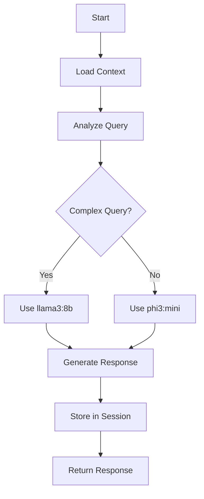
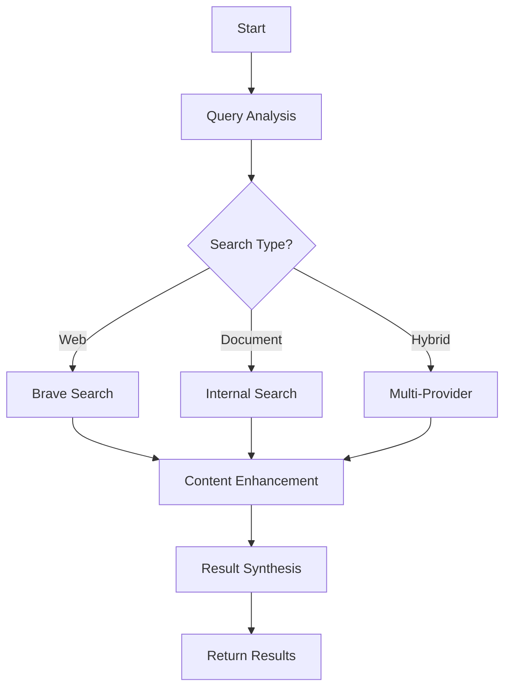

# App Context for Agents

## 🤖 Agent Integration Guide

This document provides comprehensive context for AI agents working with the Unified AI Platform. It covers application structure, available components, APIs, and best practices for agent interactions.

---

## 📋 Table of Contents

1. [Application Overview](#application-overview)
2. [Core Components](#core-components)
3. [Agent-Accessible APIs](#agent-accessible-apis)
4. [Data Models & Schemas](#data-models--schemas)
5. [Graph Workflows](#graph-workflows)
6. [Provider System](#provider-system)
7. [Caching & Storage](#caching--storage)
8. [Model Management](#model-management)
9. [Configuration & Environment](#configuration--environment)
10. [Error Handling](#error-handling)
11. [Logging & Monitoring](#logging--monitoring)
12. [Best Practices for Agents](#best-practices-for-agents)

---

## 🎯 Application Overview

### System Architecture
```
┌─────────────────────────────────────────────────────────────────┐
│                    API Gateway Layer                            │
│  FastAPI + CORS + Security + Rate Limiting + Logging           │
└─────────────────────────────────────────────────────────────────┘
                                │
┌─────────────────────────────────────────────────────────────────┐
│                Graph-Based Orchestration                        │
│  LangGraph Workflows + Adaptive Routing + Thompson Sampling    │
└─────────────────────────────────────────────────────────────────┘
                                │
┌─────────────────────────────────────────────────────────────────┐
│                Core Processing Layer                            │
│  Model Manager + Provider System + Cache Management            │
└─────────────────────────────────────────────────────────────────┘
                                │
┌─────────────────────────────────────────────────────────────────┐
│                Storage & Analytics                              │
│  Redis (Hot Cache) + ClickHouse (Cold Analytics)               │
└─────────────────────────────────────────────────────────────────┘
```

### Application Structure
```
app/
├── api/                    # API endpoints and routers
│   ├── chat.py            # Chat API endpoints
│   ├── search.py          # Search API endpoints
│   ├── research.py        # Research API endpoints
│   ├── unified_search.py  # Unified search integration
│   └── ui.py              # UI serving endpoints
├── graphs/                 # LangGraph workflow definitions
│   ├── base.py            # Base graph classes
│   ├── chat_graph.py      # Chat workflow orchestration
│   └── search_graph.py    # Search workflow orchestration
├── models/                 # Model management and inference
│   ├── manager.py         # Model lifecycle management
│   ├── ollama_client.py   # Ollama integration
│   └── schemas.py         # Model-related schemas
├── providers/              # External service providers
│   ├── base.py            # Base provider interface
│   ├── brave_search.py    # Brave Search API integration
│   └── scrapingbee.py     # ScrapingBee API integration
├── adaptive/               # Adaptive routing and optimization
│   ├── bandit.py          # Thompson sampling implementation
│   └── router.py          # Intelligent routing logic
├── cache/                  # Caching layer
│   ├── redis_client.py    # Redis cache management
│   └── strategies.py      # Caching strategies
├── core/                   # Core utilities and configuration
│   ├── config.py          # Application configuration
│   ├── logging.py         # Structured logging
│   └── startup_monitor.py # System startup monitoring
├── schemas/                # Pydantic data models
│   ├── requests.py        # Request schemas
│   └── responses.py       # Response schemas
└── main.py                # Application entry point
```

---

## 🔧 Core Components

### 1. Model Manager (`app/models/manager.py`)

**Purpose**: Manages the lifecycle of AI models and handles intelligent model selection.

**Key Features**:
- Automatic model loading based on task complexity
- Quality-based routing (simple → phi3:mini, complex → llama3:8b)
- Model health monitoring and fallback mechanisms
- Cost tracking per model usage

**Agent Usage**:
```python
# Get model manager instance
model_manager = get_model_manager()

# Request model for specific task
model = await model_manager.get_model_for_task("analytical_reasoning")

# Generate response with cost tracking
response = await model_manager.generate_response(
    model_name="phi3:mini",
    prompt="Analyze this data...",
    max_tokens=500
)
```

**Available Models**:
- `phi3:mini` - Fast responses, general purpose
- `llama3:8b` - Complex reasoning, research workflows
- `mistral:7b` - Content analysis, bias detection
- `deepseek-llm:7b` - Specialized tasks, code generation

### 2. Graph Workflows (`app/graphs/`)

**Purpose**: Orchestrates complex AI workflows using LangGraph state machines.

**Available Graphs**:

#### ChatGraph (`app/graphs/chat_graph.py`)
- Manages conversation state and memory
- Context loading and session management
- Response generation with fallbacks

#### SearchGraph (`app/graphs/search_graph.py`)
- Web search with content enhancement
- Multi-provider search orchestration
- Result synthesis and ranking

**Graph State Schema**:
```python
class GraphState:
    # Request context
    query_id: str
    user_id: str
    session_id: str
    original_query: str
    
    # Processing state
    cost_budget_remaining: float = 20.0
    quality_requirement: str = "balanced"
    execution_path: List[str] = []
    
    # Results tracking
    confidence_scores: Dict[str, float] = {}
    costs_incurred: Dict[str, float] = {}
    final_response: str = ""
```

### 3. Provider System (`app/providers/`)

**Purpose**: Integrates external APIs and services with unified interface.

**Available Providers**:

#### Brave Search Provider
```python
# Configuration
BRAVE_API_KEY = "your_brave_api_key"
BRAVE_COST_PER_REQUEST = 0.008  # ₹0.008 per request

# Usage
search_results = await brave_provider.search(
    query="AI advancements 2024",
    max_results=10,
    market="IN"  # India market
)
```

#### ScrapingBee Provider
```python
# Configuration
SCRAPINGBEE_API_KEY = "your_scrapingbee_api_key"
SCRAPINGBEE_COST_PER_REQUEST = 0.002  # ₹0.002 per request

# Usage
content = await scrapingbee_provider.extract_content(
    url="https://example.com/article",
    render_js=True
)
```

### 4. Adaptive Routing (`app/adaptive/`)

**Purpose**: Uses Thompson sampling to optimize routing decisions based on performance.

**Key Features**:
- Cost vs. quality optimization
- Automatic learning from response feedback
- Shadow testing for production safety
- Multi-objective optimization (speed, quality, cost)

**Agent Usage**:
```python
# Get optimal route for query
route = await adaptive_router.select_route(
    query="complex research question",
    budget_remaining=15.0,
    quality_requirement="high"
)

# Record feedback for learning
await adaptive_router.record_feedback(
    route_id=route.id,
    response_time=2.5,
    quality_score=0.9,
    cost=0.05
)
```

---

## 🌐 Agent-Accessible APIs

### Chat API (`/api/v1/chat/`)

#### Unified Chat Endpoint
```http
POST /api/v1/chat/unified
Content-Type: application/json

{
    "message": "Tell me about climate change",
    "session_id": "session_123",
    "mode": "research",
    "stream": false,
    "budget": 5.0
}
```

**Response**:
```json
{
    "response": "Climate change refers to...",
    "session_id": "session_123",
    "cost_incurred": 0.02,
    "confidence_score": 0.95,
    "sources": [
        {
            "url": "https://example.com/climate",
            "title": "Climate Science Basics"
        }
    ]
}
```

#### Streaming Chat Endpoint
```http
POST /api/v1/chat/stream
Content-Type: application/json

{
    "message": "Explain quantum computing",
    "session_id": "session_456"
}
```

**Response**: Server-Sent Events stream
```
data: {"type": "token", "content": "Quantum", "delta_time": 0.1}
data: {"type": "token", "content": " computing", "delta_time": 0.2}
data: {"type": "complete", "total_tokens": 150, "cost": 0.03}
```

### Search API (`/api/v1/search/`)

#### Basic Search
```http
POST /api/v1/search/basic
Content-Type: application/json

{
    "query": "machine learning algorithms",
    "max_results": 10,
    "budget": 2.0
}
```

#### Advanced Search
```http
POST /api/v1/search/advanced
Content-Type: application/json

{
    "query": "neural networks deep learning",
    "filters": {
        "date_range": "2023-2024",
        "content_type": "academic",
        "language": "en"
    },
    "quality": "high",
    "max_results": 20
}
```

### Research API (`/api/v1/research/`)

#### Deep Research
```http
POST /api/v1/research/deep
Content-Type: application/json

{
    "topic": "sustainable energy solutions",
    "research_depth": "comprehensive",
    "budget": 10.0,
    "output_format": "structured_report"
}
```

---

## 📊 Data Models & Schemas

### Request Schemas (`app/schemas/requests.py`)

#### ChatRequest
```python
class ChatRequest(BaseModel):
    message: str = Field(..., min_length=1, max_length=4000)
    session_id: Optional[str] = None
    mode: ChatMode = ChatMode.BALANCED
    stream: bool = False
    budget: Optional[float] = Field(None, gt=0, le=50)
    context: Optional[Dict[str, Any]] = None
```

#### SearchRequest
```python
class SearchRequest(BaseModel):
    query: str = Field(..., min_length=1, max_length=1000)
    max_results: int = Field(10, ge=1, le=100)
    quality: QualityLevel = QualityLevel.BALANCED
    budget: Optional[float] = Field(None, gt=0, le=20)
    filters: Optional[SearchFilters] = None
```

### Response Schemas (`app/schemas/responses.py`)

#### ChatResponse
```python
class ChatResponse(BaseModel):
    response: str
    session_id: str
    cost_incurred: float
    confidence_score: float
    processing_time: float
    model_used: str
    sources: List[Source] = []
    metadata: Dict[str, Any] = {}
```

#### SearchResponse
```python
class SearchResponse(BaseModel):
    results: List[SearchResult]
    total_results: int
    cost_incurred: float
    processing_time: float
    confidence_score: float
    query_analysis: QueryAnalysis
    sources_used: List[str]
```

---

## 🔄 Graph Workflows

### Chat Workflow


### Search Workflow


---

## 💾 Caching & Storage

### Redis Cache (`app/cache/redis_client.py`)

**Cache Keys Structure**:
```
# Session cache
session:{session_id} -> session_data
session:{session_id}:messages -> conversation_history

# Search cache
search:{query_hash} -> search_results
search:{query_hash}:metadata -> search_metadata

# Model cache
model:{model_name}:status -> model_status
model:{model_name}:metrics -> performance_metrics

# User cache
user:{user_id}:preferences -> user_preferences
user:{user_id}:budget -> remaining_budget
```

**Cache Usage**:
```python
# Store search results
await cache_manager.set(
    key=f"search:{query_hash}",
    value=search_results,
    ttl=3600  # 1 hour
)

# Retrieve cached results
cached_results = await cache_manager.get(f"search:{query_hash}")

# Session management
await cache_manager.store_session(session_id, session_data)
session = await cache_manager.get_session(session_id)
```

### Storage Strategies

#### Hot Cache (Redis)
- Session data (TTL: 1 hour)
- Frequently accessed search results (TTL: 30 minutes)
- Model status and metrics (TTL: 5 minutes)
- User preferences (TTL: 24 hours)

#### Cold Storage (ClickHouse)
- Long-term analytics data
- Historical search patterns
- Cost tracking and budgets
- Performance metrics

---

## 🤖 Model Management

### Model Selection Logic

```python
MODEL_ASSIGNMENTS = {
    "simple_classification": "phi3:mini",     # Fast responses
    "qa_and_summary": "phi3:mini",            # General purpose
    "analytical_reasoning": "llama3:8b",      # Complex reasoning
    "deep_research": "llama3:8b",            # Research workflows
    "resume_parsing": "deepseek-llm:7b",     # Specialized tasks
    "bias_detection": "mistral:7b",          # Content analysis
}
```

### Model Health Monitoring

```python
# Check model availability
model_status = await model_manager.check_model_health("phi3:mini")

# Expected response
{
    "model_name": "phi3:mini",
    "status": "healthy",
    "response_time": 0.5,
    "memory_usage": "2.1GB",
    "last_checked": "2024-01-15T10:30:00Z"
}
```

### Model Performance Metrics

```python
# Get model performance data
metrics = await model_manager.get_model_metrics("llama3:8b")

# Expected response
{
    "model_name": "llama3:8b",
    "avg_response_time": 2.3,
    "requests_per_minute": 15,
    "success_rate": 0.98,
    "avg_quality_score": 0.92,
    "cost_per_token": 0.0001
}
```

---

## ⚙️ Configuration & Environment

### Environment Variables

```bash
# Core settings
ENVIRONMENT=production
DEBUG=false
LOG_LEVEL=info
PORT=8000

# External services
REDIS_URL=redis://localhost:6379
OLLAMA_HOST=http://localhost:11434
BRAVE_API_KEY=your_brave_api_key
SCRAPINGBEE_API_KEY=your_scrapingbee_api_key

# Performance tuning
DEFAULT_MONTHLY_BUDGET=20.0
RATE_LIMIT_PER_MINUTE=60
TARGET_RESPONSE_TIME=2.5
MAX_CONCURRENT_REQUESTS=100

# Model configuration
DEFAULT_MODEL=phi3:mini
FALLBACK_MODEL=tinyllama
MODEL_TIMEOUT=30
MAX_TOKENS_PER_REQUEST=4096

# Cache configuration
REDIS_TTL_SESSION=3600
REDIS_TTL_SEARCH=1800
REDIS_TTL_MODELS=300
REDIS_MAX_MEMORY=512mb
```

### Application Settings (`app/core/config.py`)

```python
class Settings(BaseSettings):
    # Application
    app_name: str = "Unified AI Platform"
    version: str = "1.0.0"
    debug: bool = False
    
    # API
    api_v1_str: str = "/api/v1"
    rate_limit_per_minute: int = 60
    
    # Models
    default_model: str = "phi3:mini"
    fallback_model: str = "tinyllama"
    model_timeout: int = 30
    
    # Budget and costs
    default_monthly_budget: float = 20.0
    brave_cost_per_request: float = 0.008
    scrapingbee_cost_per_request: float = 0.002
    
    class Config:
        env_file = ".env"
```

---

## 🚨 Error Handling

### Standard Error Response Format

```json
{
    "error": {
        "code": "MODEL_UNAVAILABLE",
        "message": "The requested model is currently unavailable",
        "details": {
            "model": "llama3:8b",
            "suggested_fallback": "phi3:mini"
        },
        "correlation_id": "req_123456789"
    }
}
```

### Common Error Codes

| Code | Description | Suggested Action |
|------|-------------|------------------|
| `MODEL_UNAVAILABLE` | Requested model is offline | Use fallback model |
| `BUDGET_EXCEEDED` | Monthly budget limit reached | Wait for reset or increase budget |
| `RATE_LIMIT_EXCEEDED` | Too many requests | Implement backoff strategy |
| `QUERY_TOO_COMPLEX` | Query exceeds processing limits | Simplify query or increase budget |
| `PROVIDER_ERROR` | External service error | Retry with different provider |
| `CACHE_MISS` | Cache unavailable | Proceed without cache |

### Error Handling for Agents

```python
try:
    response = await chat_api.send_message(message)
except ModelUnavailableError as e:
    # Use fallback model
    response = await chat_api.send_message(
        message, 
        model=e.suggested_fallback
    )
except BudgetExceededError as e:
    # Handle budget limitation
    await notify_user("Budget exceeded, reducing quality")
    response = await chat_api.send_message(
        message, 
        quality="fast"
    )
```

---

## 📝 Logging & Monitoring

### Structured Logging Format

```json
{
    "timestamp": "2024-01-15T10:30:00.123Z",
    "level": "INFO",
    "logger": "chat_graph",
    "correlation_id": "req_123456789",
    "user_id": "user_789",
    "session_id": "session_456",
    "message": "Chat response generated successfully",
    "data": {
        "model_used": "phi3:mini",
        "response_time": 1.23,
        "cost_incurred": 0.02,
        "tokens_generated": 150
    }
}
```

### Key Metrics to Monitor

#### Performance Metrics
- Response time per endpoint
- Model inference time
- Cache hit/miss ratios
- Concurrent request counts

#### Business Metrics
- Cost per request by model
- Budget utilization rates
- User satisfaction scores
- Model quality metrics

#### System Health
- Model availability status
- Memory and CPU usage
- Redis connection health
- External API response times

### Monitoring Endpoints

```http
GET /health/live       # Liveness probe
GET /health/ready      # Readiness probe
GET /health            # Detailed health check
GET /metrics           # Prometheus metrics
GET /system/status     # Comprehensive system info
```

---

## 🎯 Best Practices for Agents

### 1. Efficient Model Usage

```python
# Good: Use appropriate model for task complexity
if task_complexity == "simple":
    model = "phi3:mini"  # Fast and cost-effective
elif task_complexity == "complex":
    model = "llama3:8b"  # Better quality for complex tasks

# Good: Implement fallback strategy
try:
    response = await model_manager.generate(model="llama3:8b", prompt=prompt)
except ModelUnavailableError:
    response = await model_manager.generate(model="phi3:mini", prompt=prompt)
```

### 2. Cost-Aware Operations

```python
# Good: Track and respect budget limits
if remaining_budget < estimated_cost:
    # Use cheaper alternatives
    response = await use_cached_response(query)
    if not response:
        response = await use_fast_model(query)
else:
    response = await use_high_quality_model(query)

# Good: Implement cost tracking
cost_tracker = CostTracker(user_id)
await cost_tracker.record_cost(operation="search", amount=0.008)
```

### 3. Caching Strategy

```python
# Good: Check cache before expensive operations
cache_key = f"search:{hash(query)}"
cached_result = await cache.get(cache_key)

if cached_result:
    return cached_result
else:
    result = await expensive_search_operation(query)
    await cache.set(cache_key, result, ttl=1800)  # 30 minutes
    return result
```

### 4. Error Resilience

```python
# Good: Implement retry logic with exponential backoff
@retry(
    stop=stop_after_attempt(3),
    wait=wait_exponential(multiplier=1, min=4, max=10)
)
async def robust_api_call(endpoint, data):
    try:
        return await api_client.post(endpoint, json=data)
    except NetworkError as e:
        logger.warning(f"Network error, retrying: {e}")
        raise
```

### 5. Session Management

```python
# Good: Maintain conversation context
class ConversationAgent:
    def __init__(self, session_id: str):
        self.session_id = session_id
        self.context = ConversationContext(session_id)
    
    async def send_message(self, message: str):
        # Load conversation history
        history = await self.context.get_history()
        
        # Generate response with context
        response = await chat_graph.process(
            message=message,
            history=history,
            session_id=self.session_id
        )
        
        # Update conversation history
        await self.context.add_exchange(message, response.content)
        return response
```

### 6. Quality Monitoring

```python
# Good: Implement quality feedback loop
class QualityMonitor:
    async def evaluate_response(self, query: str, response: str):
        # Check response quality
        quality_score = await self.calculate_quality(query, response)
        
        # Record metrics
        await self.record_quality_metric(
            query_type=classify_query(query),
            model_used=response.model,
            quality_score=quality_score
        )
        
        # Trigger alerts if quality drops
        if quality_score < 0.7:
            await self.alert_quality_issue(query, response, quality_score)
```

### 7. Resource Management

```python
# Good: Manage concurrent operations
semaphore = asyncio.Semaphore(10)  # Limit concurrent requests

async def process_query_batch(queries: List[str]):
    async def process_single(query: str):
        async with semaphore:  # Limit concurrency
            return await process_query(query)
    
    tasks = [process_single(q) for q in queries]
    return await asyncio.gather(*tasks, return_exceptions=True)
```

---

## 🔗 Integration Examples

### Agent Integration Template

```python
from app.dependencies import get_model_manager, get_cache_manager
from app.graphs.chat_graph import ChatGraph
from app.schemas.requests import ChatRequest

class CustomAgent:
    def __init__(self):
        self.model_manager = get_model_manager()
        self.cache_manager = get_cache_manager()
        self.chat_graph = ChatGraph()
    
    async def process_user_query(self, query: str, user_id: str):
        # Create request
        request = ChatRequest(
            message=query,
            session_id=f"agent_{user_id}",
            mode="research",
            budget=5.0
        )
        
        # Process through graph
        response = await self.chat_graph.process(request)
        
        # Log interaction
        logger.info(
            "Agent processed query",
            extra={
                "user_id": user_id,
                "query_length": len(query),
                "response_length": len(response.content),
                "cost_incurred": response.cost_incurred
            }
        )
        
        return response
```

### Multi-Agent Orchestration

```python
class AgentOrchestrator:
    def __init__(self):
        self.research_agent = ResearchAgent()
        self.summary_agent = SummaryAgent()
        self.fact_check_agent = FactCheckAgent()
    
    async def comprehensive_analysis(self, topic: str):
        # Research phase
        research_results = await self.research_agent.investigate(topic)
        
        # Summary phase
        summary = await self.summary_agent.summarize(research_results)
        
        # Fact-checking phase
        verified_summary = await self.fact_check_agent.verify(summary)
        
        return {
            "topic": topic,
            "research": research_results,
            "summary": verified_summary,
            "confidence": self.calculate_confidence(verified_summary)
        }
```

---

## 📚 Additional Resources

### Documentation Links
- [API Documentation](http://localhost:8000/docs) - Interactive API docs
- [Architecture Guide](./ARCHITECTURE.md) - Detailed system architecture
- [Deployment Guide](./DEPLOYMENT_GUIDE.md) - Production deployment
- [Performance Metrics](./PERFORMANCE_SUMMARY.md) - System performance data

### Development Tools
- **Health Checks**: `/health/*` endpoints for system monitoring
- **Metrics**: `/metrics` endpoint for Prometheus integration
- **Debug Mode**: Set `DEBUG=true` for detailed logging
- **Test Suite**: Run `pytest tests/` for comprehensive testing

### Support Channels
- **Issues**: GitHub Issues for bug reports
- **Discussions**: GitHub Discussions for feature requests
- **Documentation**: Wiki for additional guides
- **Monitoring**: Grafana dashboards for real-time monitoring

---

*This document is maintained as part of the Unified AI Platform documentation suite. For updates and contributions, please refer to the project repository.*
