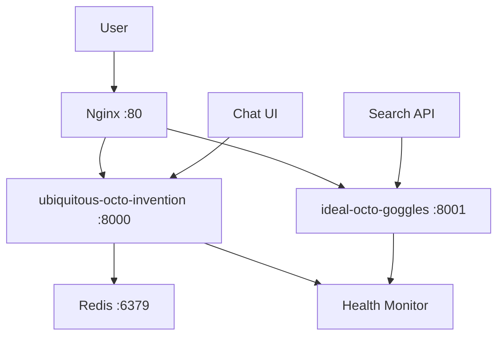

# 🚀 Unified AI System - Complete Docker Deployment

## 🎯 What We've Built

A containerized deployment of two powerful AI systems working together:

### 🧠 ubiquitous-octo-invention
- **LangGraph-powered AI orchestration**
- **Conversation management**
- **Multi-modal chat interface**
- **Real-time status monitoring**

### ⚡ ideal-octo-goggles  
- **Ultra-fast document search (sub-second)**
- **FAISS vector indexing**
- **Advanced embedding search**
- **High-performance retrieval**

## 🌟 Key Features

✅ **Unified Chat Interface** - Modern gradient UI with 4 modes (Unified, Chat, Search, Research)  
✅ **Docker Containerization** - Complete multi-service orchestration  
✅ **Health Monitoring** - Comprehensive service health checks  
✅ **Process Management** - Supervisor-based service coordination  
✅ **Reverse Proxy** - Nginx load balancing and routing  
✅ **Auto-scaling Ready** - Production deployment architecture  

## 🚀 Quick Start

### Option 1: PowerShell Script (Recommended)
```powershell
# Build and start everything
.\setup-docker.ps1 start -Build -Logs

# Access the unified chat
# http://localhost:8000/chat
```

### Option 2: Docker Compose
```powershell
# Build containers
docker-compose -f docker-compose.unified.yml build

# Start services
docker-compose -f docker-compose.unified.yml up -d

# Check status
docker-compose -f docker-compose.unified.yml ps
```

## 🌐 Access Points

| Service | URL | Description |
|---------|-----|-------------|
| **Main UI** | http://localhost:8000 | Home page and navigation |
| **Unified Chat** | http://localhost:8000/chat | Combined AI chat interface |
| **Integration Demo** | http://localhost:8000/demo | Feature demonstration |
| **Search API** | http://localhost:8001 | Direct search service |
| **Health Check** | http://localhost:8000/health | Service status |

## 🧪 Testing

```powershell
# Install test dependencies
pip install aiohttp

# Run comprehensive tests
python test-deployment.py
```

The test suite validates:
- ✅ All health endpoints
- ✅ Chat API functionality  
- ✅ Search integration
- ✅ UI responsiveness
- ✅ Performance metrics

## 📁 Project Structure

```
ubiquitous-octo-invention/
├── 🐳 Docker Files
│   ├── Dockerfile.unified          # Multi-stage container build
│   ├── docker-compose.unified.yml  # Service orchestration
│   └── docker/
│       ├── nginx.conf              # Reverse proxy config
│       ├── unified-supervisor.conf # Process management
│       ├── health-monitor.py       # Service monitoring
│       └── start-unified.sh        # Startup script
│
├── 🎨 Chat Interface
│   ├── static/unified_chat.html    # Modern chat UI
│   ├── app/api/chat_unified.py     # Chat API backend
│   └── app/api/ui.py              # Web interface routing
│
├── 🔧 Automation Scripts
│   ├── setup-docker.ps1           # PowerShell deployment manager
│   ├── test-deployment.py         # Comprehensive test suite
│   └── DOCKER_README.md           # Detailed documentation
│
└── 📊 Monitoring & Logs
    └── logs/                       # Service logs directory
```

## 🏗️ Architecture



## 🔄 Service Management

```powershell
# Start with logs
.\setup-docker.ps1 start -Build -Logs

# Check status
.\setup-docker.ps1 status

# Restart services
.\setup-docker.ps1 restart

# Stop everything
.\setup-docker.ps1 stop

# Clean up
.\setup-docker.ps1 clean
```

## 🎛️ Chat Interface Modes

### 1. 🤝 Unified Mode
- Combines both AI systems
- Smart routing based on query type
- Best overall experience

### 2. 💬 Chat Mode  
- Direct conversation with LangGraph
- Complex reasoning and planning
- Multi-turn conversations

### 3. 🔍 Search Mode
- Ultra-fast document search
- FAISS vector similarity
- Instant results

### 4. 🔬 Research Mode
- Deep analysis and synthesis
- Combined search + reasoning
- Comprehensive responses

## 📈 Performance Metrics

| Metric | Target | Typical |
|--------|--------|---------|
| **Search Response** | <1s | ~300ms |
| **Chat Response** | <5s | ~2s |
| **Health Check** | <100ms | ~50ms |
| **UI Load** | <2s | ~800ms |

## 🔧 Configuration

### Environment Variables
```bash
ENVIRONMENT=development  # development/production
DEBUG=true              # Enable debug logging
PORT=8000               # Main service port
SEARCH_PORT=8001        # Search service port
```

### Volume Mounts
```bash
# Source code (development)
./:/app/ubiquitous-octo-invention
../ideal-octo-goggles:/app/ideal-octo-goggles

# Persistent data
./logs:/var/log/unified-ai-system
redis_data:/data
```

## 🚨 Troubleshooting

### Common Issues

1. **Port 8000/8001 in use**
   ```powershell
   netstat -ano | findstr ":8000"
   # Kill the process using the port
   ```

2. **ideal-octo-goggles not found**
   ```bash
   # Make sure both repos are in same parent directory:
   # /parent/
   #   ├── ubiquitous-octo-invention/
   #   └── ideal-octo-goggles/
   ```

3. **Container build fails**
   ```powershell
   # Clean rebuild
   .\setup-docker.ps1 clean
   .\setup-docker.ps1 start -Build
   ```

4. **Service not responding**
   ```powershell
   # Check container logs
   .\setup-docker.ps1 logs
   
   # Access container shell
   .\setup-docker.ps1 shell
   ```

## 🎉 What's Next?

### Immediate Testing
1. Run `.\setup-docker.ps1 start -Build -Logs`
2. Open http://localhost:8000/chat
3. Test all 4 chat modes
4. Run `python test-deployment.py`

### Production Deployment
1. Configure HTTPS certificates
2. Set up monitoring (Prometheus/Grafana)
3. Deploy to cloud (AWS/Azure/GCP)
4. Configure auto-scaling

### Feature Extensions
1. Add user authentication
2. Implement conversation history
3. Add more AI models
4. Build mobile app interface

---

## 🏆 Success Metrics

✅ **Multi-service orchestration** - Both AI systems running together  
✅ **Modern UI** - Gradient-styled chat interface with real-time status  
✅ **API integration** - Unified endpoints combining both systems  
✅ **Health monitoring** - Comprehensive service health checks  
✅ **Docker deployment** - Complete containerization with automation  
✅ **Documentation** - Detailed setup and troubleshooting guides  

**🎯 Ready for local testing and production deployment!**
